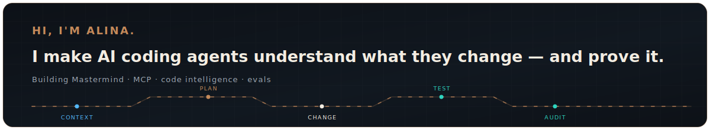

<picture>
  <source media="(max-width: 600px) and (prefers-color-scheme: dark)" srcset="./assets/profile-hero-mobile-dark.svg">
  <source media="(max-width: 600px) and (prefers-color-scheme: light)" srcset="./assets/profile-hero-mobile-light.svg">
  <source media="(prefers-color-scheme: dark)" srcset="./assets/profile-hero-dark.svg">
  <source media="(prefers-color-scheme: light)" srcset="./assets/profile-hero-light.svg">
  
</picture>

<strong>I build infrastructure that makes AI coding agents more reliable.</strong>

  
  
  
  
  

## Building now

I'm the creator of [Mastermind](https://github.com/xcrft/mastermind), a local-first code intelligence and verification layer for Claude Code, Codex, Cursor, and Continue.

- **Understand** — local Rust codegraph, project maps, and structural queries over MCP
- **Change safely** — change-impact and test-impact analysis grounded in the repository
- **Verify** — diff-backed implementation audits and behavioral evaluations for agent workflows

## Featured work

### [Mastermind](https://github.com/xcrft/mastermind)

Gives AI coding agents a structural view of real code and an evidence-backed path from context to verified change. [npm](https://www.npmjs.com/package/@xcraftmind/mastermind) · [crates.io](https://crates.io/crates/mmcg)

## Focus

`AI agent reliability` · `MCP` · `code intelligence` · `evaluation` · `application security`

## Writing & contact

[LinkedIn](https://www.linkedin.com/in/alina-glumova-67b0b292) · [Medium](https://medium.com/@alina.glumova)
