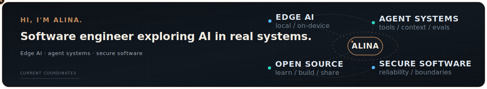

<picture>
  <source media="(max-width: 800px) and (prefers-color-scheme: dark)" srcset="./assets/profile-hero-v4-mobile-dark.svg">
  <source media="(max-width: 800px) and (prefers-color-scheme: light)" srcset="./assets/profile-hero-v4-mobile-light.svg">
  <source media="(prefers-color-scheme: dark)" srcset="./assets/profile-hero-v4-dark.svg">
  <source media="(prefers-color-scheme: light)" srcset="./assets/profile-hero-v4-light.svg">
  
</picture>

## Lately

- exploring on-device inference and local AI
- working with agent tools, MCP, and evaluations
- thinking about security and reliability in AI products

## Open source

I contribute to [Mastermind](https://github.com/xcrft/mastermind), a local-first code intelligence and verification layer for AI coding agents. [npm](https://www.npmjs.com/package/@xcraftmind/mastermind) · [crates.io](https://crates.io/crates/mmcg)

## Elsewhere

[LinkedIn](https://www.linkedin.com/in/alina-glumova-67b0b292) · [Medium](https://medium.com/@alina.glumova)
