<picture>
  <source media="(max-width: 800px)" srcset="./assets/profile-terminal-v6-mobile.svg">
  
</picture>

## Lately

- exploring Edge AI and local-first intelligence
- building with LLMs, agents, MCP, and evaluations
- learning how to make AI systems safer and more reliable

## Open source

I contribute to [Mastermind](https://github.com/xcrft/mastermind), a local-first code intelligence and verification layer for AI coding agents. [npm](https://www.npmjs.com/package/@xcraftmind/mastermind) · [crates.io](https://crates.io/crates/mmcg)

## Elsewhere

[LinkedIn](https://www.linkedin.com/in/alina-glumova-67b0b292) · [Medium](https://medium.com/@alina.glumova)
