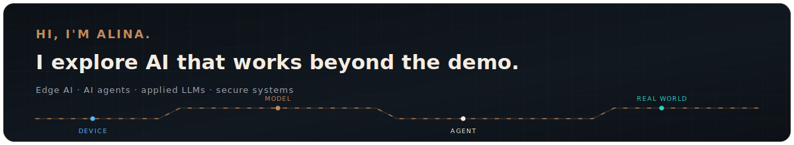

<picture>
  <source media="(max-width: 600px) and (prefers-color-scheme: dark)" srcset="./assets/profile-hero-v3-mobile-dark.svg">
  <source media="(max-width: 600px) and (prefers-color-scheme: light)" srcset="./assets/profile-hero-v3-mobile-light.svg">
  <source media="(prefers-color-scheme: dark)" srcset="./assets/profile-hero-v3-dark.svg">
  <source media="(prefers-color-scheme: light)" srcset="./assets/profile-hero-v3-light.svg">
  
</picture>

## About me

I'm an AI enthusiast and software engineer interested in what happens when AI meets real constraints: devices, products, security, and people. I explore Edge AI, agentic systems, and applied LLMs, with a focus on making intelligent software useful and trustworthy.

## What I'm exploring

- **Edge AI** — models and inference that work close to where data is created
- **Agentic systems** — how agents use tools, context, and feedback to get useful work done
- **Useful, secure AI** — turning LLM capabilities into software people can rely on

## Open source

I contribute to [Mastermind](https://github.com/xcrft/mastermind), a local-first code intelligence and verification layer for AI coding agents. [npm](https://www.npmjs.com/package/@xcraftmind/mastermind) · [crates.io](https://crates.io/crates/mmcg)

## Writing & contact

[LinkedIn](https://www.linkedin.com/in/alina-glumova-67b0b292) · [Medium](https://medium.com/@alina.glumova)
